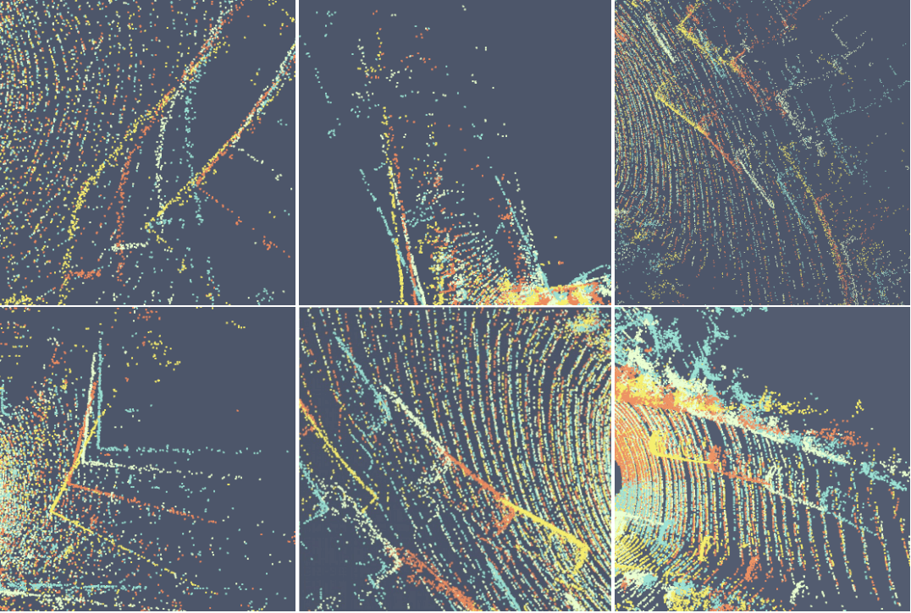
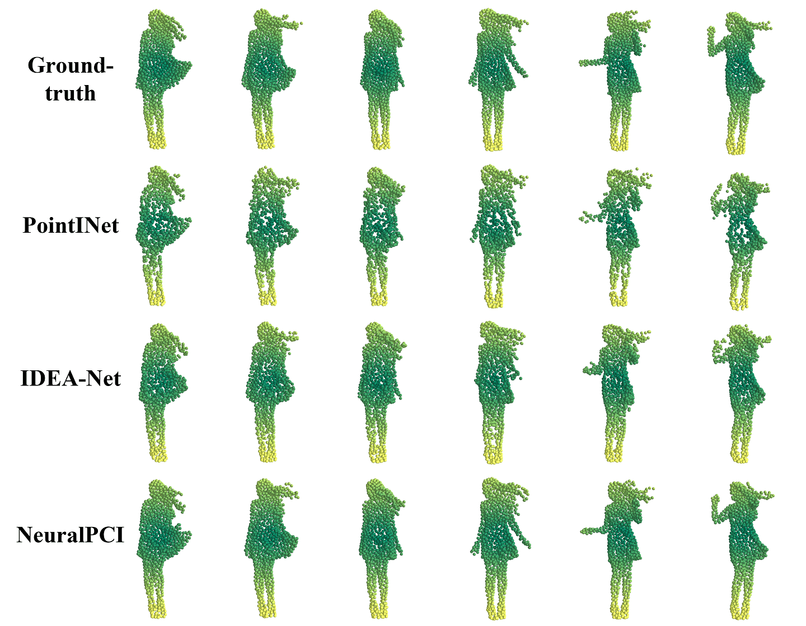
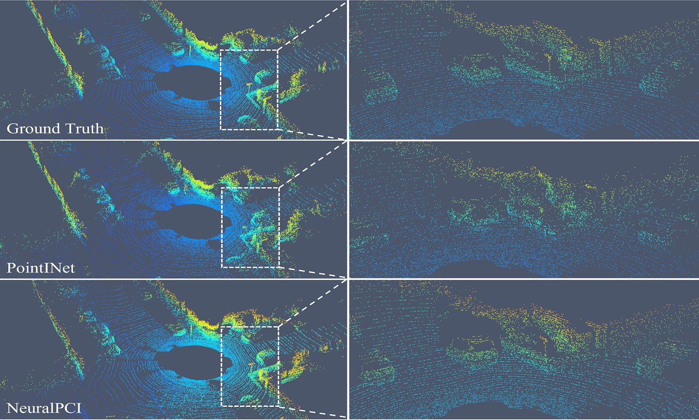

# NeuralPCI
  
**NeuralPCI: Spatio-temporal Neural Field for 3D Point Cloud Multi-frame Non-linear Interpolation**   
[Zehan Zheng](https://dyfcalid.github.io/)\*, Danni Wu\*, Ruisi Lu, [Fan Lu](https://fanlu97.github.io/), [Guang Chen](https://ispc-group.github.io/)†, Changjun Jiang.   
(\* Equal contribution, † Corresponding author)  
**CVPR 2023**  

**[[Paper]](https://arxiv.org/abs/2303.15126) | [[Project Page]](https://dyfcalid.github.io/NeuralPCI)**  


| Indoor Scenario  | Outdoor Scenario |
| ------------- | ------------- |
| <video src="https://user-images.githubusercontent.com/51731102/228475246-e0f2d3c8-adad-41d5-a474-c05a2945cb20.mp4">  | <video src="https://user-images.githubusercontent.com/51731102/228474998-37c81904-061b-4b35-b70e-465c94a93ed8.mp4">|


<!-- TABLE OF CONTENTS -->
<details open="open" style='padding: 10px; border-radius:5px 30px 30px 5px; border-style: solid; border-width: 1px;'>
  <summary>Table of Contents</summary>
  <ol>
    <li>
      <a href="#changelog">Changelog</a>
    </li>
    <li>
      <a href="#get-started">Get Started</a>
    </li>
    <li>
      <a href="#introduction">Introduction</a>
    </li>
    <li>
      <a href="#benchmark">Benchmark</a>
    </li>
    <li>
      <a href="#visualization">Visualization</a>
    </li>
    <li>
      <a href="#citation">Citation</a>
    </li>
    <li>
      <a href="#license">License</a>
    </li>
  </ol>
</details>

## Changelog  
2023-3-27: We post the preprint paper on arXiv and release the project page.  
2023-2-28: This paper is accepted by **CVPR 2023** 🎉🎉.  

## Introduction

This repository is the PyTorch implementation for **NeuralPCI**.  
   
NeuralPCI is an end-to-end 4D spatio-temporal Neural field for 3D Point Cloud Interpolation, which implicitly integrates multi-frame information to handle nonlinear large motions for both indoor and outdoor scenarios.
  

  
The 4D neural field is constructed by encoding the spatio-temporal coordinates of the multi-frame input point clouds via a coordinate-based multi-layer perceptron network. For each point cloud frame of the input, the interpolation time is set to the corresponding timestamps of four input frames for NeuralPCI to generate the corresponding point cloud. And then the neural field is optimized on runtime in a self-supervised manner without relying on ground truth. In the inference stage after optimization, NeuralPCI receives a reference point cloud and an arbitrary interpolation frame moment as input to generate the point cloud of the associated spatio-temporal location.


## Get Started
**[COMING SOON]** 🚧 We are preparing for the release of the codes and datasets asap.


## Dataset

### NL-Drive
  

Download link: [To be released]
  
### DHB
  Download link: [[Google Drive]](https://drive.google.com/drive/folders/1Oaras1mV6DOICMPkCggPZvnBAtc4SKgH?usp=sharing)

## Benchmark  
  

## Visualization

  

  
## Citation

If you find our code or paper useful, please cite
```bibtex
@inproceedings{zheng2023neuralpci,
  title     = {NeuralPCI: Spatio-temporal Neural Field for 3D Point Cloud Multi-frame Non-linear Interpolation},
  author    = {Zheng, Zehan and Wu, Danni and Lu, Ruisi and Lu, Fan and Chen, Guang and Jiang, Changjun},
  booktitle = {Proceedings of the IEEE/CVF Conference on Computer Vision and Pattern Recognition (CVPR)},
  year      = {2023}
  }
```


## License
  All code within this repository is under [Apache License 2.0](https://www.apache.org/licenses/LICENSE-2.0).
